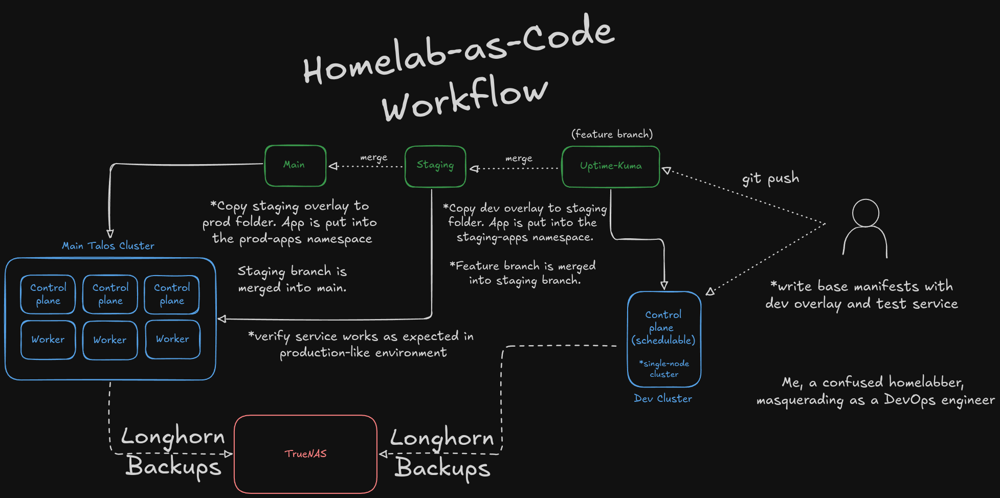

## Flux CD

[FluxCD](https://fluxcd.io) is a GitOps tool for continuous deployment on Kubernetes. This tool allows me to define the state of my cluster within this Git repo and have those changes automatically applied on ```git push```. 

There are two clusters in my environment -- **dev** and **talos**. The **dev** cluster is a single-node cluster used to test out a new service's compatibility with Kubernetes. Once compatibility has been determined and a rough base of required manifests have been written, the service will be moved to the primary **talos** cluster, on which there are two environments -- **staging** and **prod**.

These two environments are separated via Kubernetes namespaces. The **staging-apps** namespace is used to place a service that has been previously validated on the **dev** cluster. The staging environment is identical to the production environment (since it is on the same cluster... Ideally, I would have a separate, but identical cluster for the staging environment. But... this is a homelab). 



### Installing Flux CLI

The first step is to install the flux CLI tool:

```
brew install fluxcd/tap/flux
```

Next, bootstrap flux on your cluster.

In the case of multiple clusters, ensure you are using the correct context for the desired cluster:

```bash
kubectl config current-context # Check the current context
kubectl config use-context <name-of-context> # Change to a different context
```

### Bootstrapping Flux
https://fluxcd.io/flux/installation/bootstrap/gitea/

First, create the repository in Gitea. Then, generate a personal access token with the following permissions:

```
read:misc
write:repository
```

Save the token into the following environment variable

```bash
export GITEA_TOKEN=<gt-token>
```

#### 1. Bootsrap the **dev** cluster

The dev cluster is bootstrapped against a feature branch named after a service that is being tested/developed (ex. uptime-kuma). First, make sure your ```kubectl``` context is set to the dev cluster:

```bash
kubectl config use-context dev # Ensure kubectl is set to the dev cluster context
```

Before bootstrapping, remove the ```clusters/dev/flux-system``` folder and commit this change to the new feature branch:

```
git branch uptime-kuma
git checkout uptime-kuma
rm -r clusters/dev/flux-system
git commit -m "removed previous flux config"
git push origin uptime-kuma
```

Then, uninstall flux components:

```
flux uninstall --keep-namespace
```

Finally, bootstrap against the new feature branch:

```
flux bootstrap gitea \
  --token-auth \
  --owner=joshrnoll \
  --repository=homelab-as-code \
  --branch=uptime-kuma \
  --path=clusters/dev \
  --personal \
  --hostname=gitea.mydomain.com
```

#### 2. Bootsrap the **talos** cluster

The main Talos cluster is bootstrapped against the **main** branch, pointing to the ```clusters/talos``` folder. First, ensure your ```kubectl``` context is set to the talos context:

```bash
kubectl config use-context talos # Ensure kubectl is set to the talos cluster context
```

Then, bootstrap Flux:

```
flux bootstrap gitea \
  --token-auth \
  --owner=joshrnoll \
  --repository=homelab-as-code \
  --branch=main \
  --path=clusters/talos \
  --personal \
  --hostname=gitea.mydomain.com
```

Though this cluster is *bootstrapped* against the **main** branch, it will also reference apps committed to the **staging** branch. Staging and Production are separated via namespaces. Apps will be automatically placed in the correct namespace due to the use of ```spec.targetNamespace``` field in the Kustomization resource. 

Refer to the ```clusters/talos/apps-prod.yaml``` and ```clusters/talos/apps-staging.yaml``` to better understand how this works.